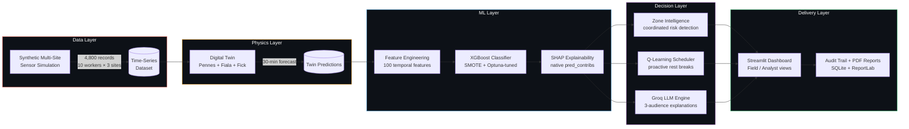
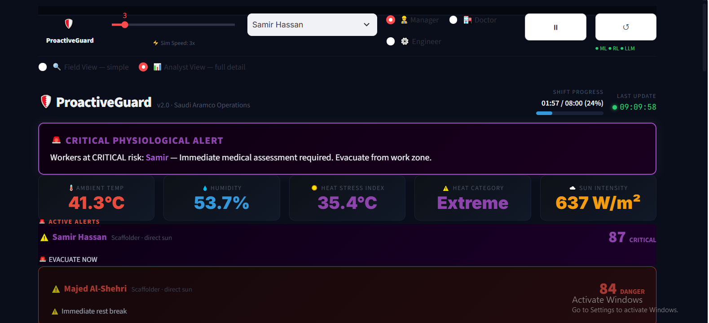
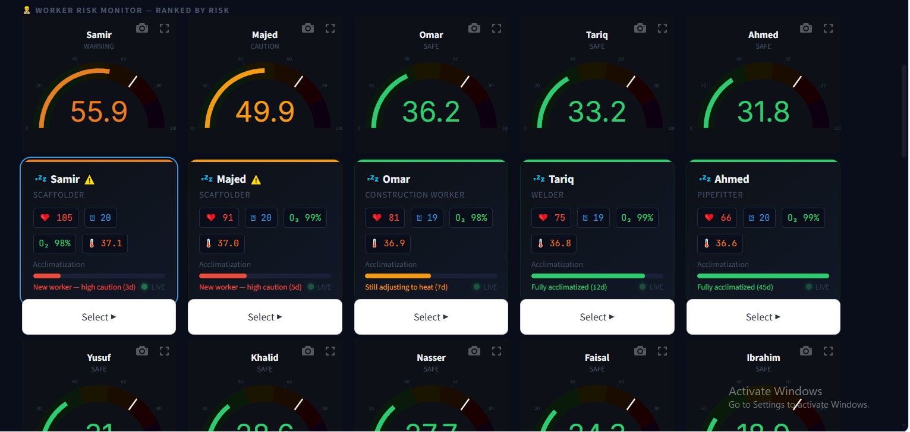
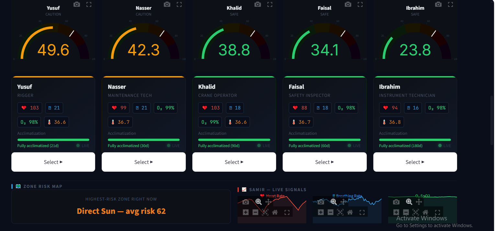
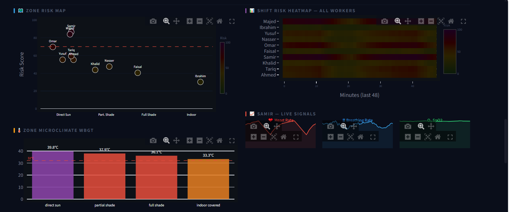
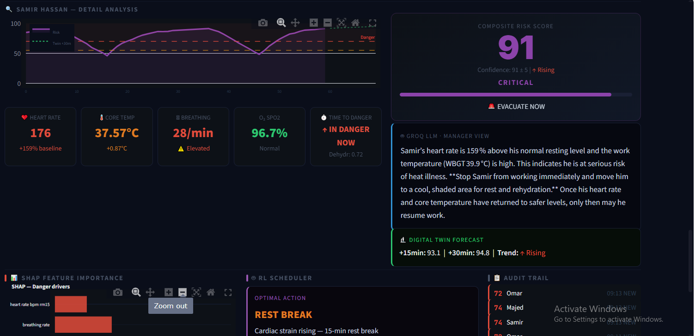
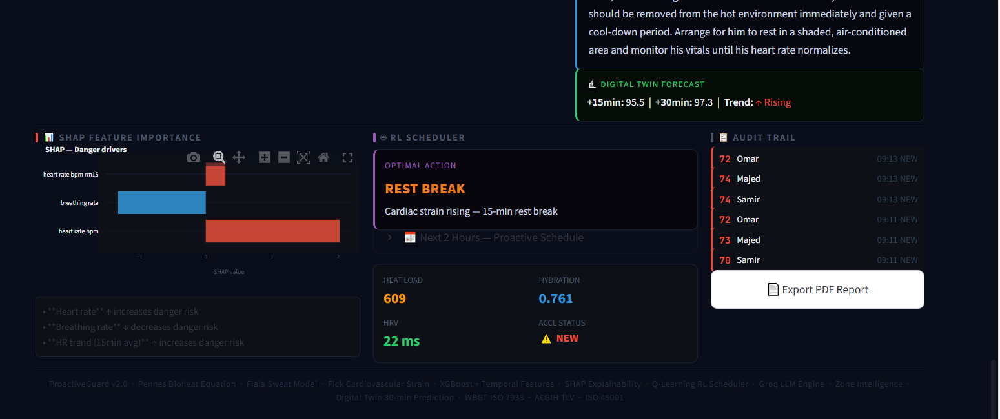

<div align="center">

# 🛡️ ProactiveGuard v2.0

### Predictive Heat-Stroke Risk Engine for Industrial Workforces

**A per-worker, per-minute physiological forecasting system that predicts heat stress
15–30 minutes before it becomes dangerous — not after.**

[](https://www.python.org/)
[](https://xgboost.readthedocs.io/)
[](https://streamlit.io/)
[](https://shap.readthedocs.io/)
[](https://groq.com/)
[](LICENSE)

</div>

---

## The Problem

Wearable safety systems already deployed at large industrial sites — WakeCap-style
helmets, for example — beep once a worker's core temperature crosses a fixed danger
threshold (e.g. 38°C). That's **reactive**: by the time the alert fires, the worker is
already in physiological distress.

Site-wide hazard platforms (e.g. i4Safety-class systems) monitor general environmental
conditions across a facility, but they don't model any *individual* worker's personal
baseline, acclimatization history, workload, or real-time microclimate.

**Nobody in this space combines both**: a per-worker physiological forecast that
accounts for *that specific person's* resting heart rate, days-on-site, workload
category, and exact zone conditions — predicting danger *before* it happens rather than
alarming once it already has.

ProactiveGuard is that predictive layer.

---

## What It Actually Does

| Capability | How |
|---|---|
| **30-minute-ahead risk forecasting** | Physics-based digital twin (Pennes Bioheat Equation + Fiala sweat model + Fick cardiovascular strain), cross-validated against an XGBoost classifier |
| **Personal baselines, not fixed thresholds** | Every worker's resting HR, max HR, and acclimatization status feed the model individually — a 110 bpm reading means something different for a 90-day veteran than a 3-day new hire |
| **Explainable, not a black box** | Live SHAP attribution shows exactly which signals are driving a worker's risk score, computed via XGBoost's native `pred_contribs` API |
| **Three audiences, one system** | The same event is explained differently for a site manager (plain language, one action), an occupational physician (clinical staging, vitals), and an engineer (SHAP values, model confidence) — via a Groq-hosted LLM with an offline rule-based fallback |
| **Coordinated hazard detection** | Distinguishes "3+ workers spiking in the same zone" (environmental event → evacuate the zone) from an isolated individual case (→ send that one worker for a break) |
| **Proactive scheduling** | A Q-learning agent recommends rest-break timing *before* a worker reaches a danger state, not after |
| **Full audit trail & compliance reporting** | SQLite-backed alert history, escalation logging, PDF shift reports, FMEA documentation aligned to ISO 45001 / ACGIH TLV / WBGT ISO 7933 |

---

## Architecture



Eight independent modules, each runnable and testable on its own, feeding a single
shared configuration (`v2_config.py`) so the worker roster and site definitions have
exactly one source of truth across the whole pipeline.

---

## Screenshots

### Live risk monitoring — Analyst View
Full technical detail: coordinated zone-evacuation alerts, real-time environmental
conditions, ranked worker risk gauges.





### Field View — simplified for a 10-second spot-check
The same data, stripped to what a supervisor actually needs mid-shift: no SHAP values,
no scatter plots — just "which zone is worst right now" in plain language.



### Zone intelligence & shift heatmap


### Per-worker detail: digital twin forecast + Groq-generated manager explanation


### SHAP explainability, RL scheduler, and audit trail


---

## Real Model Results

These are the actual metrics from training on the synthetic 4,800-record multi-site
dataset — not illustrative numbers.

| Metric | Value |
|---|---|
| F1 Score (weighted) | **0.9941** |
| F1 Score (macro) | **0.9301** |
| AUC-ROC | **0.9998** |
| Uncertain predictions | 0.4% |
| Engineered features | 100 (temporal lags, rolling means, rates of change) |
| Class imbalance handling | SMOTE (danger class was 12.4% of records) |
| Hyperparameter search | Optuna, 3,000 trials |
| Top SHAP driver (danger class) | `heart_rate_bpm` |

**Read the full picture, not just the headline number**: F1-macro (0.93) sitting below
F1-weighted (0.99) is expected and reported deliberately — the "danger" class is the
minority class by design (heat-stroke events are rare), and macro F1 weights all three
classes equally rather than letting the abundant "safe" class dominate the score. That
gap is the honest signal of how hard the rare-event class actually is, not something
smoothed over.

---

## Engineering Highlights (for the technically curious)

A few decisions worth knowing about if you're reviewing this as a hiring signal rather
than just running the demo:

- **XGBoost/SHAP compatibility**: `shap.TreeExplainer` has a known multi-class
  `base_score` parsing incompatibility with recent XGBoost versions. Rather than patch
  around shap's internals (three attempts, each surfacing a different root cause —
  documented in `v2_model.py`), the explainability layer uses XGBoost's own native
  `pred_contribs` SHAP computation, which sidesteps the cross-library serialization
  boundary entirely.
- **RL agent pickling**: training a custom `QAgent` class as `__main__` and loading it
  from a separate process (the dashboard) is a classic Python pickling failure mode.
  Fixed by pickling only the learned Q-table (plain `numpy` data has no class-identity
  issue) and reconstructing a fresh agent instance on load.
- **Single source of truth**: the worker roster and site definitions were originally
  duplicated across *seven* separate files. Consolidated into `v2_config.py`, imported
  everywhere else — eliminating an entire class of "the dashboard shows different data
  than the CLI tools" bugs.
- **Sparse RL state coverage**: the Q-learning agent's 300-state space only gets ~15%
  real coverage from training episodes (a structural property of the environment, not
  fixable by more training time). Rather than let `argmax` silently return a
  meaningless default action for untrained states, unvisited states fall back to a
  risk-graded heuristic consistent with the rest of the codebase's thresholds.

---

## Tech Stack

**Data & Physics**: pandas, numpy, `ephem` (solar position modeling)
**ML**: XGBoost, scikit-learn, imbalanced-learn (SMOTE), Optuna, SHAP
**Explainability**: SHAP (native XGBoost `pred_contribs`)
**RL**: custom tabular Q-learning
**LLM**: Groq API (`openai/gpt-oss-20b`) with offline rule-based fallback
**Dashboard**: Streamlit, Plotly
**Reporting**: ReportLab (PDF), SQLite (audit trail)

Zero paid infrastructure. Runs entirely on a laptop.

---

## Quickstart

```bash
git clone https://github.com/<your-username>/proactiveguard.git
cd proactiveguard
python -m venv venv
venv\Scripts\activate          # Windows
# source venv/bin/activate     # macOS/Linux

pip install -r requirements.txt
cp .env.example .env           # then add your GROQ_API_KEY
```

Run the full pipeline in order (each stage depends on the previous one's output):

```bash
python v2_data_engine.py
python v2_digital_twin.py
python v2_model.py
python v2_zone_engine.py
python v2_rl_scheduler.py
python v2_safety_infrastructure.py
python v2_llm_engine.py
streamlit run v2_dashboard.py
```

Or use the one-command runner:

```bash
python run_pipeline.py
```

---

## Why This Matters at Aramco / NEOM / SABIC

Saudi Arabia's Vision 2030 industrial expansion is happening in some of the most
extreme sustained heat conditions on Earth (WBGT regularly exceeding 40°C at Gulf
coastal sites). Existing deployed systems — WakeCap's threshold alerts, i4Safety's
site-wide hazard monitoring — are reactive or generic. Aramco's own occupational
health guidelines already reference WBGT-based heat stress categories; this system
operationalizes that standard into a predictive, per-worker tool rather than a
compliance checkbox.

---

## Limitations & Future Work

Being upfront about what this is and isn't:

- **Synthetic data.** The dataset is physics-based simulation, not real sensor
  captures — appropriate for a portfolio/prototype, not a validated clinical tool.
  Deploying against real wearables would need a calibration pass against actual field
  data.
- **Single-shift simulation.** Each worker's data represents one 8-hour shift, not
  longitudinal multi-day history. True acclimatization tracking (which genuinely
  requires day-over-day resting-HR trends) isn't possible with this dataset — the
  system currently uses configured `accl_days` as an honest proxy rather than
  fabricating a multi-day trend the data doesn't support.
- **RL state coverage.** The Q-learning scheduler's state space is structurally sparse
  (~15% real coverage even with heavy training) because risk and shift-hour are
  naturally correlated in the environment. The fallback heuristic covers this, but a
  production version would benefit from function approximation (e.g. a small neural
  Q-network) instead of a tabular approach.
- **Groq API dependency.** The three-audience LLM explanations depend on a third-party
  API with its own model deprecation cycle (already hit once during development — see
  engineering notes). The rule-based fallback keeps the system functional offline, but
  loses some of the nuance.
- **Not validated against real heat-stroke incidents.** No ground-truth clinical
  outcome data exists to validate the danger-probability calibration against actual
  medical events.

---

## Repository Structure

```
proactiveguard/
├── v2_config.py                  # Single source of truth: workers, sites, zones
├── v2_data_engine.py              # Synthetic multi-site sensor data generation
├── v2_digital_twin.py             # Pennes/Fiala/Fick physics-based 30-min forecast
├── v2_model.py                    # XGBoost + SMOTE + Optuna + SHAP
├── v2_zone_engine.py               # Zone WBGT + coordinated risk detection
├── v2_rl_scheduler.py             # Q-learning proactive scheduling
├── v2_safety_infrastructure.py    # Audit trail, drift detection, PDF reports, FMEA
├── v2_llm_engine.py                # Groq-based 3-audience explanations
├── v2_dashboard.py                 # Streamlit control-room UI
├── requirements.txt
├── run_pipeline.py                # One-command full pipeline runner
├── .streamlit/config.toml         # Dashboard theme
└── docs/
    ├── screenshots/
    └── engineering-notes.md        # Detailed debugging/design log
```

---

## License

MIT — see [LICENSE](LICENSE).

<div align="center">

Built as a demonstration of production ML engineering practices: real physics
modeling, honest metric reporting, explainability by design, and documented
engineering trade-offs rather than a black-box demo.

</div>
